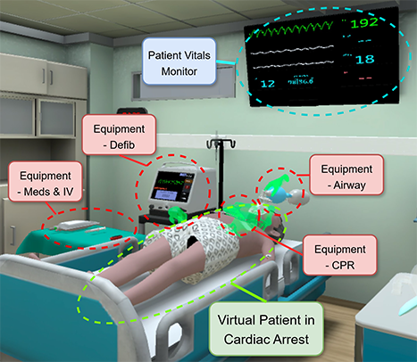

# Appendix

**How to use this document.** The **main paper** states the contributions. This file adds **definitions, counts, questionnaire text, and procedures** so reviewers can verify details. Entries are mostly **tables and bullet facts**; narrative is kept short.

## Formative Study Materials

### Additional participant details

**Formative interviews (n = 7).** As in the main text: seven semi-structured sessions (45–60 minutes each) with ACLS instructors (minimum five years of experience training cardiac arrest teams); **five female, two male**; **mean clinical experience = 24 years** (aggregate); specialties **paramedic (1), nursing (4), emergency medicine (1), family medicine (1)**.

**Expert walkthrough (n = 1).** One **emergency medicine physician** instructor reviewed recorded **VR cardiac-arrest team training** footage using a **baseline debriefing tool** with **video replay and timeline navigation**, then contrasted interpretation with an **early debriefing system prototype with Attention entropy curves** (see protocol below). No individual identifiers are reported.


| Cohort                               | n   | Role / context (high level)                                         |
| ------------------------------------ | --- | ------------------------------------------------------------------- |
| Semi-structured formative interviews | 7   | ACLS clinical instructors (see specialty split above)               |
| Expert walkthrough                   | 1   | Emergency medicine; simulation video review + prototype walkthrough |


### Formative interview and walkthrough prompts

**Semi-structured interview guide.** Facilitators covered the following topics (with follow-up probes):

- **Background and debriefing practice:** how the instructor currently prepares for debriefing after simulation, and how video or logs are used.
- **Locating teachable moments:** how candidate moments are noticed when reviewing recordings (what counts as “salient,” time pressure, team vs.\ individual focus).
- **Gaze and attention evidence:** whether and how gaze or attention-related cues could support (or complicate) interpretation of learner reasoning; expectations of **proxy** vs.\ **ground-truth** evidence.
- **Representations and burden:** reactions to **dense gaze displays** (e.g., heatmaps, scanpaths, curves), preferences for **episodes**, **summaries**, or **semantic abstractions** tied to task context.
- **From observation to debriefing talk:** friction moving from “something happened here” to **clinically grounded** and **dialogue-ready** prompts; need for scaffolds vs.\ improvisation.
- **Closing:** desired dashboard/debriefing features and concerns (privacy, group debrief, cognitive load).

**Expert walkthrough protocol (four steps, from the structured expert review session).**

1. **Baseline review:** Expert-team simulation video with **free pause** for discussion; identify **teachable moments** relevant to debriefing.
2. **Prototype introduction:** Early debriefing system prototype (video panel, timeline, **entropy / self-loop** signals, **event** markers).
3. **Re-review with prototype:** Same expert-team footage with ReadGaze overlays; discuss whether curves support **attention** and **teamwork** interpretation.
4. **Comparative segment:** Short **novice-team** clip to contrast **communication, delegation, and attention** patterns and whether ReadGaze supports **differential** interpretation.

### Additional representative quotations supporting F1–F3

Labels **P1–P10** are **not** the formal user study’s participant IDs; they index **anonymous excerpts** from the formative design discussions (see provenance above).

**F1 — Gaze as useful proxy, not ground truth (interpretive caution).**

- **P1:** “[Gaze] is meant to be a proxy for where your focus is… It’s just important… to have it **with a grain of salt** because maybe you were just staring off into space cuz your brain was so busy but you’re just looking at one thing because it’s easier than… continuing to track around the room.”
- **P2:** “A lot of times… you can see that from their pupil tracking, but they **don’t integrate** that information… there was a clear change, but… I don’t know what that is.”
- **P3:** “The gaze is a **good proxy for decision-making**… it could be represented as a heat map… or… as… areas of interest or the sequence… you can really unfold where I look first, second, third.”

**F2 — Raw or dense gaze displays impose interpretive burden; need for semantics and simpler presentation.**

- **P4:** “Things like gaze, cognitive load, and positions… need **a little bit more interpretation**. I think you need to **do something with that data** before it’s useful.”
- **P5:** “It’s **less so**… tracking… throughout the course… it’s very much so… **episodes**… when you’re looking at the monitor, how does your eyes… go through that monitor?… I think those **episodes**… would be… **more useful**.”
- **P6:** “That data’s **not friendly**, though. It’s **not friendly to interpret**… I **don’t really understand it very well**… I think… **presenting** [it] in a very… **simple way**” would help.
- **P7:** “This top part, that heat map… I don’t think you need to go as detail-oriented as that. It can just be… **here’s the path** that you took… I don’t think you need to go… **three-dimensional**.”

**F3 — From noticing moments to debriefing-ready prompts (scaffolding gap).**

- **P8:** “I find myself… having to **pick a few**… You try to watch the session, **come up with a theme on your own**… So I’m not sure that a big tally sheet would be helpful or not.”
- **P9:** “If you have an option to **review that specific segment**, we can either **with the group or not with the group**.”
- **P10:** “The debriefing dashboard should **identify your metrics with the expected metrics**… compare yourself to what your **ideal scenario** looks like… I wanted to know **at what point** did I miss establishing an airway… when would’ve that **ideal place** in the scenario [be]?”

**Expert walkthrough (observer note).** Low-entropy / high–self-loop segments were used as **cues for debriefing questions** (e.g., leader tracking, CPR timing salience), not as freestanding error labels—**F3** / **D3**.

### Summary table mapping F1–F3 to D1–D3


| Finding                                             | Design implication                                                                               | Manifestation in ReadGaze (concise)                                                                                                                    |
| --------------------------------------------------- | ------------------------------------------------------------------------------------------------ | ------------------------------------------------------------------------------------------------------------------------------------------------------ |
| **F1** Gaze as useful proxy, not definitive truth   | **D1** Human-in-the-loop interpretation; outputs as **cues**, not correctness labels             | **Queryable Attention Dynamics** framed as **diagnostic semantics**; replay-linked **verification**; language that avoids “ground truth” judgments.    |
| **F2** High burden of raw gaze displays             | **D2** Abstract traces into **interpretable attention states** aligned with **phase and events** | **Scope–Intensity** states; timeline and **clinical context**; interaction primitives for inspecting states/transitions/AOI without raw path decoding. |
| **F3** Gap from observation to debriefing questions | **D3** **Diagnostic scaffolding** from inspected evidence → replay check → **prompt**            | **Debriefing support layer**: diagnostic notes, **EvidenceBox**, **ShapeDebriefing** / inquiry-oriented prompts tied to anchored moments.              |


## Representation and Validation Details

**Contents:** AOI set $\mathcal{A}$ and object→AOI examples; preprocessing and **30 s / 5 s** windows; *H* (**Scope**) and *L* (**Intensity**) worked example; **14-session** counts; validation checks **V1–V4**; window-size **κ**; cohort splits; pseudocode. **Numbers below match the main paper** unless noted. **No** session IDs; cohorts are aggregate-only.

### AOI set and object-to-AOI mapping

Seven AOIs (codes ↔ labels) match the main text **Representation** / attention-state table.

| Internal code         | Human-readable label                                              |
| --------------------- | ----------------------------------------------------------------- |
| `AOI_AirwayEquipment` | Equipment – Airway                                                |
| `AOI_CPRHands`        | Equipment – CPR                                                   |
| `AOI_DefibEquipment`  | Equipment – Defib                                                 |
| `AOI_Meds_Procedure`  | Equipment – Meds & IV                                             |
| `AOI_Monitor`         | Patient Vitals Monitor                                            |
| `AOI_NPC/Other`       | Other Team Members (and non-mapped / teleport UI when applicable) |
| `AOI_PatientCore`     | Patient                                                           |


**Object name → AOI:** normalized **exact** codebook row, else **containment** fallback → one of the seven codes. **Sample rows** (codebook is longer):

| Simulation object name (excerpt) | Object type (excerpt) | AOI |
| --------------------------------- | --------------------- | --- |
| `pulse_neck_defib` | PulseCheckPoint(Neck)Defib | `AOI_PatientCore` |
| `pulse_neck_bvm` | PulseCheckPoint(Neck)Airway | `AOI_PatientCore` |
| `pulse_groin_defib` | PulseCheckPoint(Groin)Defib | `AOI_PatientCore` |
| `pulse_groin_bvm` | PulseCheckPoint(Groin)Airway | `AOI_PatientCore` |
| `female_avatar1` | NPC | `AOI_NPC/Other` |

*More examples:* `cpr_hands_obbjjj` → `AOI_CPRHands`; `Upper Part Vital Cognitive` → `AOI_Monitor`; `Pump_Mask_Interactable_R(Clone)` → `AOI_AirwayEquipment`; `Sync` → `AOI_DefibEquipment`; `Syringe_Injection_Interactable_Right(Clone)` → `AOI_Meds_Procedure`. **Teleport UI** objects (e.g. `Teleport Icon Tablet 2`) → **`AOI_NPC/Other`** in the seven-AOI scheme (see AOI table footnote).

**Figure A1.** Seven-AOI layout in the simulation view.



### Preprocessing and sliding windows

**Manuscript pipeline.** **Dispersion-based** fixations; **merge** same-AOI fixations when gap **≤ 300 ms** (see main text **Input** / **Representation**). **Scope** *H* and **Intensity** *L* on **team-lead** streams, simulation time.

- **Merged AOI segments for transitions.** For attention-transition tabulation, consecutive fixations that map to the **same AOI** along the temporal sequence are merged into one segment before deriving ordered AOI transitions. Object names (and categories where used) are mapped to AOIs via the codebook, with category-level fallbacks (e.g. monitor-like categories → monitor, patient-related → patient core) consistent with the transition-table utility.
- **Sliding windows.** **W = 30 s**, step **5 s**; label time = window center **$t_0 + W/2$**; *H* / *L* summarize transitions with end times in **$[t_0,\, t_0 + W)$** (simulation-aligned).

### Worked example: Scope–Intensity (*H* = Scope, *L* = Intensity)

The **compute_routing_metrics** routine in the team-lead realtime entropy module proceeds as follows.

1. **Transition list.** From fixation-level AOI sequence inside the window, form consecutive pairs $(\text{from}, \text{to})$ (after any AOI merge step used upstream).
2. **Count matrix.** For each source AOI *i*, tally outgoing counts $n_{ij}$ to destination *j*. Let $r_i = \sum_j n_{ij}$ be the row total and $N = \sum_i r_i$ the total number of transitions.
3. **Routing entropy *H* (self-loops excluded from the outgoing distribution).** For each source *i* with **off-diagonal mass** $o_i = \sum_{j \neq i} n_{ij} > 0$, compute Shannon entropy (base 2) over **only** destinations $j \neq i$, using conditional probabilities $p_{ij} = n_{ij} / o_i$:

   $$
   H_i = -\sum_{j \neq i,\, n_{ij}>0} p_{ij} \log_2 p_{ij}.
   $$

   Rows with $o_i = 0$ contribute **zero** to the entropy numerator; the implementation still increments the weight sum by $r_i$ for those rows. Because $\sum_i r_i = N$ over all emitting sources in the window, the reported value is

   $$
   H = \frac{1}{N}\sum_{i:\, o_i > 0} H_i \cdot r_i,
   $$

   equivalent to `weighted_entropy / weight_sum` in code (with `weight_sum` = N for the nonempty count matrix).
4. **Weighted self-loop *L*.** For each source *i*, self-loop proportion $s_i = n_{ii} / r_i$ (0 if $r_i = 0$). The global weighted self-loop is

   $$
   L = \sum_i \frac{r_i}{N} \cdot s_i = \frac{1}{N}\sum_i n_{ii}.
   $$

   The last equality holds because $\frac{r_i}{N}\cdot\frac{n_{ii}}{r_i}=\frac{n_{ii}}{N}$; the code implements the weighted form explicitly.

**Synthetic toy (three AOIs).** Suppose the window yields these seven transitions in order:  
X→Y, X→Y, X→X, Y→Z, Y→X, Z→Z, Z→X.


| From To | X   | Y   | Z   | Row total $r_i$ |
| ------- | --- | --- | --- | ------------- |
| X       | 1   | 2   | 0   | 3             |
| Y       | 1   | 0   | 1   | 2             |
| Z       | 1   | 0   | 1   | 2             |


Here $N = 7$.

- **Row X:** $o_X = 2$, only Y off-diagonal: $H_X = -\log_2(1) = 0$.
- **Row Y:** $o_Y = 2$, $p_{Y\to Z}=p_{Y\to X}=\frac{1}{2}$: $H_Y = 1$ bit.
- **Row Z:** $o_Z = 1$, only X: $H_Z = 0$.

Weighted entropy numerator: $0\cdot 3 + 1\cdot 2 + 0\cdot 2 = 2$. Weight sum: $3+2+2 = 7$. **$H = \frac{2}{7} \approx 0.286$** bits.

$$
\frac{3}{7}\cdot\frac{1}{3} + \frac{2}{7}\cdot 0 + \frac{2}{7}\cdot\frac{1}{2} = \frac{2}{7} \approx 0.286.
$$

**$L = \frac{2}{7}$**.

This matches **compute_routing_metrics** on the same transition multiset.

### Dataset scope (team leader, 14 sessions)

| Quantity | Value |
| -------- | ----- |
| VR sessions | **14** |
| Raw fixations | **77,041** |
| After same-AOI merge (gap ≤ 300 ms) | **40,998** |
| Role for *H* / *L* | **Team lead** |
| Analysis windows (30 s / 5 s) | **2,232** |
| Contiguous state segments (after run merge) | **666** |
| Novice sessions (trainee-led) | **10** |
| Expert sessions (ACLS instructor–led) | **4** |

No session IDs in this appendix.

### Validation (same order as main text **Dataset and Validation**)

Labels **V1–V4** = internal logging IDs for the four checks below.

#### 1. Internal consistency (V2)

**Method.** Pool all windows **within each state**; report mean **unique AOI count**, **dominant AOI proportion**, mean *H*, mean *L* (pooled, not double-averaged across sessions first).

**Results.** **S1** vs **S4**: mean unique AOI count **4.52** vs **3.19**; mean dominant proportion **0.617** vs **0.741** (pooled within-state across windows; see main text **Attention-state semantics**).

#### 2. Temporal coherence (V3)

**Method.** Segment = contiguous same-state run. **Median / mean** duration on **pooled** segments. **Flips/min** = per session: (segment count − 1) / session duration (minutes); then mean across sessions.

**Results.** **666** segments total; **median** duration **10.0 s**, **mean** **16.8 s**; **63.4%** of segments ≥ **10 s**; mean flip rate **3.54** flips/min (typical per-session range about **2.7–5.0** flips/min). Longest observed bout **120 s**.

#### 3. Construct validity — shocks (V1)

**Method.** Shock times = defib action log. Bins vs shock: **Pre** −10–0 s, **Post** 0–15 s, **Late** 15–30 s; **Baseline** = outside shock-relative bins. **Wilcoxon** on **one summary per session** (e.g. Post vs Baseline state proportion).

**Results (aggregate).** All **14** sessions contribute shock events (**83** shocks total). Example window counts: Pre **133**, Post **204**, Late **183**, Baseline **1712**. Baseline state mix approximately **S1 23.6%**, **S2 24.1%**, **S3 21.0%**, **S4 31.3%**. Post-window **S1 (Broad Scanning)** proportion **51.5%** vs baseline **23.6%** (**+27.9** percentage points unweighted). Session-level **Post vs Baseline** on **S1**: median Post **50.0%** vs Baseline **23.6%**, **W = 1**, **p = .0002**, **r = .864**, **13/14** sessions in the expected direction. **Pre vs Baseline** on **S4**: medians **8.3%** vs **33.3%**, **p = .002**, **r = .780**.

#### 4. Cross-session stability in *H*–*L* space

**Method.** Each window is plotted in the *H*–*L* plane. Classification into **S1–S4** uses **per-session** medians of *H* and *L* as thresholds $T_H$, $T_L$ (see Pseudocode 3)—**canonical** for all reported analyses.

**Pooled medians (optional figure only).** Across all sessions, example global **$T_E = 0.943$**, **$T_L = 0.701$** (same quadrant layout as main **Scope–Intensity** figure). **Reported statistics** use **per-session** medians unless stated otherwise.

#### Supplementary: clinical stage boundaries (V4)

**Method.** State flip rate **near stage boundaries** vs **within-stage** intervals.

**Results.** **5 / 14** sessions: higher flip rate near boundaries; pooled boundary minus interior **≈ +0.3%**.

### Window-size sensitivity

**Method.** Recompute *H* and *L* with **$W \in \{20, 30, 45\}\ \text{s}$**, step **5 s**. Reclassify states using **per-window-size** median thresholds; compute **Cohen’s κ** between label sequences on the same timeline for each session; report mean $\kappa$ across sessions.

**Results (14 sessions).**

| Compare | Mean κ (SD) |
| ------- | ----------- |
| W 20 vs 30 s | **0.533** (**0.060**) |
| W 30 vs 45 s | **0.539** (**0.075**) |
| W 20 vs 45 s | **0.372** |
| Mean of three pairings | **~0.48** |

State occupancy ~**28–31%** per state across *W*. Flip rate (flips/min): **4.32** / **3.45** / **2.69** for W = 20 / 30 / 45 s.

### Expert / novice comparison (session-level)

**Assignment:** **Expert** = ACLS instructor team lead (**n = 4**); **novice** = resident or student team lead (**n = 10**) (main text **Dataset and Validation**).

**Tests.** Mann–Whitney *U* on session-level summaries (two-sided).

| Outcome (examples) | Pattern |
| ------------------ | ------- |
| State occupancy (S1–S4) | No cohort difference (*p* > .67 for tests reported in internal tally) |
| Total monitor dwell % (session) | Expert **~12%** vs novice **~22%** (*p* < .05) |
| Bout transition entropy, NPC/other dwell | Trends *p* < .10 in internal tally |
| **S4→S1** bout prevalence | Novice **~3%** vs expert **~1%** (*p* < .05); related metric **r ≈ 0.58** |

Detail: main text.

### Pseudocode

**Pseudocode 1 — Merge adjacent same-AOI segments**

```
INPUT: fixation rows with AOI and time order
SORT by start time
INITIALIZE empty list segments, cursor = first row’s AOI, start = first start, end = first end
FOR each subsequent row r:
    IF r.AOI == cursor:
        end = r.end
    ELSE:
        APPEND segment(cursor, start, end)
        cursor = r.AOI; start = r.start; end = r.end
APPEND final segment
OUTPUT: segments
```

**Pseudocode 2 — Sliding window routing metrics**

```
INPUT: fixation-derived AOI transitions as (from_AOI, to_AOI, time_to)
W, step = 30, 5  // seconds
FOR window start t0 in 0, step, 2*step, ... while t0 + W <= T_sim:
    label_time = t0 + W/2
    T = all transitions with t0 <= time_to < t0 + W
    (H, L, ...) = ComputeRoutingMetrics(T)  // as in “Worked example” / compute_routing_metrics
    EMIT row (label_time, H, L, ...)
```

**Pseudocode 3 — Four-way state from per-session medians**

```
INPUT: series of (H, L) for one session’s windows
T_H = median(all H); T_L = median(all L)
FOR each window:
    IF H >= T_H AND L <  T_L: state = 1  // S1 Broad Scanning (high Scope, low Intensity)
    IF H >= T_H AND L >= T_L: state = 2  // S2 Targeted Check
    IF H <  T_H AND L <  T_L: state = 3  // S3 Anchored with Shifts
    IF H <  T_H AND L >= T_L: state = 4  // S4 Sustained Fixation
OUTPUT: state per window (exact quadrant order matches production code)
```

**Pseudocode 4 — Event-locked bins and session-level paired test**

```
INPUT: shock times; per-window state labels; session boundaries
DEFINE bins relative to each shock: Pre, Post, Late; Baseline = windows in none of these
FOR each session s:
    p_post(s) = proportion of windows in Post that are state k (or vector for k=1..4)
    p_base(s) = same for Baseline
FOR hypothesis on state k:
    PAIRS = {(p_post(s), p_base(s)) for all sessions with valid data}
    EFFECT = Wilcoxon signed-rank on paired differences (session-level)
OUTPUT: test statistic, p-value, effect size r
```

## Monitor-Threshold Flagging Details

**Setup (team lead).** Same **30 s / 5 s** windows and **S1–S4** labels as Scope–Intensity (*H*, *L* per-session medians). **Monitor %** = fixation duration on **Patient Vitals Monitor** ÷ all-AOI fixation duration in that window × 100 (same fixation rules as main text).

**Expert P90 (monitor %), *n* = 4 instructor sessions:** pool expert windows **by state**; flag if monitor % **>** state P90.

| State | P90 monitor proportion (%) |
| ----- | -------------------------: |
| S1 (Broad Scanning) | **16.17** |
| S4 (Sustained Fixation) | **33.16** |

**S1/S4 only.** State-stratified novice vs expert monitor-% contrasts in the cohort tally **concentrate in S1 and S4**, not **S2/S3**; expert P90 flags apply **only** to **S1** and **S4** windows (main text **Dataset and Validation**).

**Rules (proportion only).**

| If | Then |
| -- | ---- |
| State **S1**, monitor % **> 16.17** | Flag |
| State **S4**, monitor % **> 33.16** | Flag |
| State **S2** or **S3** | No flag (no P90 threshold on this track) |

**Numeric examples:**

| Pattern | State | Monitor prop. | Outcome |
| ------- | ----- | ------------: | ------- |
| Example 1 | S4 | 8% | Below P90 — not flagged |
| Example 2 | S4 | 40% | Above 33.16% — flagged |
| Example 3 | S1 | 5% | Below P90 — not flagged |
| Example 4 | S1 | 19% | Above 16.17% — flagged |

**Use.** Debriefing prompts aligned to expert distributions; **not** a clinical rule. Cohort monitor patterns: main text **Dataset and Validation**.

## Formal User Study Materials

**Design:** Within-subjects; **N = 7** instructors; **Baseline** vs **ReadGaze**; same debriefing-prep task. **IRB consent, tutorial video, and field protocol** are authoritative; this section = **task text + survey items + headline session-level tallies (*n* = 7)**.

### Task prompt and think-aloud instructions

| Element | Fact |
| ------- | ---- |
| Task per condition | Same prep task; **3** required teachable moments (+ **Additional Moments** optional) |
| Stimulus | One **first-half** sim video per run |
| Order | Latin square (main text) |
| After each condition | **A1–A3** |
| After both | **D1–D7** |
| Baseline | Video + stages + events + transcript (no gaze-norming language to participant) |
| ReadGaze | Adds states, diagnostic notes, evidence jumps (**descriptive** cues) |

**Task wording.**

> Your task is:  
> Please identify **exactly 3** teachable moments from this video (our analysis will be based on these 3).  
> For each moment, please complete the following four steps:  
> 1. Specify the location (time, stage, or event)  
> 2. Describe your observation and interpretation  
> 3. Provide verifiable evidence (timestamp, screenshot, or system navigation)  
> 4. Write one guiding question you would use during the debriefing  
> Each time you identify a potential teachable moment, please **pause immediately**. While paused, use the currently available cues to fully articulate that moment (anchor → evidence → guiding question), then continue searching for the next one.  
> If you have additional ideas after completing 3, please add them in the **"Additional Moments"** section at the end of the recording sheet.  
> Please let me know when you have completed all three moments.

**Think-aloud (read once at task start).**

> As you work through this task, please try to say two things out loud:  
> 1. **What you are focusing on** — where is your attention, what data are you looking at?  
> 2. **What insights it gives you** — as an educator, what are you deriving from this information?

**Neutral prompt after long silence (e.g. >30 s).**

> Please continue thinking as you normally would. If you're comfortable, you can briefly share what you're currently focusing on and what insights it's giving you.

Maps to **Teacher Noticing**: **Attending**, **Interpreting** (Jacobs et al.).

**Optional (ReadGaze).** ~5 min on one moment: verbalize state entry/exit; **not** scored.

### Comparative interview prompts

**Interview** (~10–15 min, after both conditions). Facilitation: neutral wording (*worth discussing*, *defensible*); avoid confirmatory echo and “correctness” pressure.

| ID | Theme | Core prompt |
| -- | ----- | ---------------------- |
| Q1 | Strategy change | Did your approach to debriefing preparation change between the two interfaces? If so, which steps or thought processes differed? |
| Q1.5 | Holistic judgment (Attending) | After using these interfaces, did your view of the team's overall performance change? What information led to that? |
| Q2 | Evidence organization | In which interface was it easier to organize observations into discussable evidence? Why? |
| Q3 | Describing attention | Did you describe attention differently across interfaces? Was that helpful? |
| Q4 | Adoption & verification (**Trust calibration**) | When the interface provided attention-related cues, how did you typically handle them? Follow up: recall moments of **partial** reliance on system cues and how you verified; when cues were worth taking into debrief vs when you set them aside. **Do not** ask “was it accurate?” directly. |
| Q5 | Real-world preference | Which interface would you prefer for real debrief preparation? Why? |
| Q5.5 | Observation → debrief action (**Shaping**) | Did the way you constructed guiding questions differ? Which interface better supported concrete debriefing dialogue? |
| Q6 | Open | Anything important we haven't asked? |
| Q6.5 | Structural use (ReadGaze) | In ReadGaze, did you actively use state or transition information to locate or interpret a moment? If not, why? If yes, what changed? |
| Q6.7 | Counterfactual | If the state module were removed, what would you lose? |

### Coding details for primitive engagement and reasoning change

**Primitive engagement (observable traces).** State-strip navigation; State inspection; Transition query; Diagnostic notes; Evidence box; ShapeDebriefing; state readout aligned to video; moment found **via** primitives vs **mostly** scrubbing.

**Coding legend (cf. main Table 1.3).** **✓** = independent; **✓✓** = primary reliance; **(P)** = after prompt; **(A)** = acknowledged, rare self-initiation; **—** = not seen.

**Reasoning change (dimensions).** Anchor (time/event); interpret with attention evidence; verify (replay / navigation); debrief question **inquiry-oriented**. **Framework:** deductive codes + affinity sort under **Teacher Noticing** — **Attending / Interpreting / Shaping**.

**Optional rubric (per moment).** Four dimensions × 0–2 = 0–8 (Specificity, Actionability, Evidence alignment, Pedagogical framing) when two coders available.

### Exploratory post-session self-report measures

Survey order = deployed **field** instrument. **A1** = **two** items (mental effort, time pressure, 1–7), **not** full NASA-TLX six dimensions—label as such in any workload mention.

| Block | When | Content |
| ----- | ---- | ------- |
| Demographics | Session start | License, ACLS, age, gender, clinical/teaching experience, prior eye-tracking or attention-visualization exposure |
| A1 Workload | After each condition | 2 items, 1–7 |
| A2 Perceived evidence-chaining support | After each condition | 4 items, 1–7 |
| A3 Verification and trust | After each condition | 5 items, 1–7 (includes reversed items) |
| D1–D2 | After both conditions | Comparative ReadGaze vs other interface |
| D3–D5 | After both conditions | Preference, primary benefit, primary concern (mixed formats) |
| D6 AIM | After both conditions | ReadGaze acceptability (4 items) |
| D7 FIM | After both conditions | ReadGaze feasibility (2 items) |

### Instrument wording and descriptive summaries

**A1. Workload (each condition).** Scale 1 (Very Low) to 7 (Very High).

1. How much mental effort was required to complete the task?  
2. How much time pressure did you feel while completing the task?

**A2. Perceived evidence-chaining support.** 1 = Strongly Disagree, 7 = Strongly Agree.

1. This interface helped me locate potential teachable moments more quickly.  
2. This interface helped me ground my observations in verifiable evidence.  
3. This interface helped me organize evidence into a clear chain of reasoning.  
4. This interface helped me translate my interpretation into actionable debriefing questions.

**A3. Verification and trust.** Same scale; **(R)** = reverse-scored in analysis where applicable.

1. When forming a judgment, I was able to conveniently verify and trace back the evidence I relied on.  
2. While using this interface, I was able to remain critical and make decisions based on evidence.  
3. There were discrepancies between the interface results and my own judgment. (R)  
4. The interface reduced my autonomy and control as an educator. (R)  
5. The more I understand how this interface arrives at its results, the more I can trust it.

**D1–D2. Overall comparative (after both conditions).** 1 = Strongly Disagree, 7 = Strongly Agree.

1. Compared to the other interface, ReadGaze better supported me in constructing verifiable evidence chains.  
2. Compared to the other interface, ReadGaze better supported me in verifying and tracing back my reasoning.

**D3. Interface preference.** 1 = Strongly prefer Baseline … 4 = Neutral … 7 = Strongly prefer ReadGaze.

**D4 / D5.** Multiple-choice **primary benefit** and **primary concern** (e.g., faster moment ID; attention interpretation; evidence grounding; debrief questions; verification; overload; misleading-cue concern; usability; workflow fit; other).

**D6. AIM (acceptability).** Four items (Weiner et al., 2017–style wording), 1–7, ReadGaze-focused (approval, appeal, liking, welcoming).

**D7. FIM (feasibility).** Two items (implementable in real teaching; easy to use in practice), 1–7.

**Session-level descriptive totals (*n* = 7; merge by assigned order).**

| Measure | Value |
| ------- | ----- |
| D1 / D2 mean | **5.57 / 5.86**; **7/7** at or above midscale thresholds cited in protocol |
| D3 mean | **5.43** (7-pt, toward ReadGaze) |
| D4 (modal themes) | Attention interpretation; verification / traceability |
| D5 (count) | **6/7** cite information load as top concern |
| AIM / FIM mean | **5.32 / 4.93** (1–7) |
| A1 paired Δ | Mental effort **+1.57** (ReadGaze − Baseline); time pressure **+0.57** |
| A2 paired | ReadGaze **6.04** vs Baseline **5.38** (**+0.66**); **6/7** favor ReadGaze |
| A3 | Forward items stable; reverse-keyed means in range per protocol |

